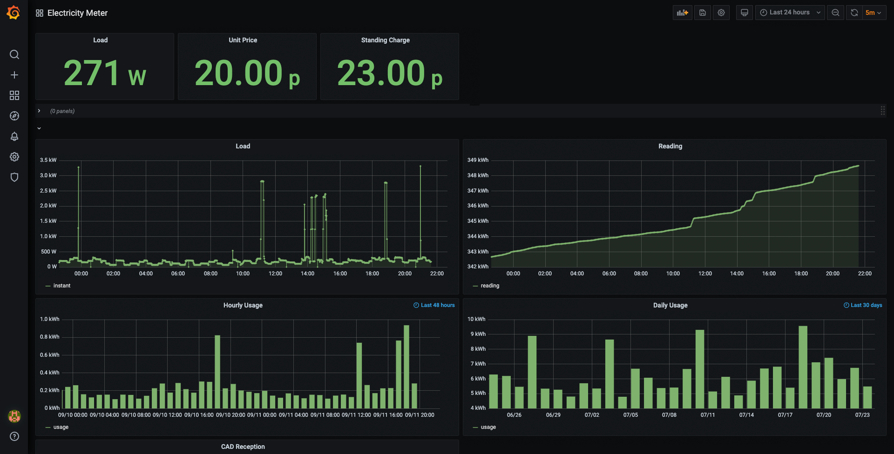

# glow-trap

Collects UK smart meter data from your in-home display made by [Glow](https://shop.glowmarkt.com/), without uploading data to their servers.

Comes with out-of-the-box demo setup with data collection, storage (InfluxDB 2) and dashboard (Grafana) but requires some manual network setup.

# Requirements

* A smart meter. You can usually request one from your energy supplier for free.
* A IHD/CAD device from Glow. I tested with [this one](https://shop.glowmarkt.com/products/display-and-cad-combined-for-smart-meter-customers).
* Docker (no privilege needed).
* Some computer network knowledge.

# Background

The IHD/CAD devices from Glow communicates with your smart meter via ZigBee and then uploads data to their servers via HTTPS so you will be able to access some data from their mobile app.

We could redirect those data to our own servers because HTTPS certificates are not being validated by the clients.

# Usage

You will need to modify your network setup in order to redirect data to your own server. There are multiple ways.

## With VLAN

If your network devices support VLAN, you can easily create an isolated network and have `glow-trap` take over everything there.

1. Create a dedicated VLAN (default: 101).
1. Create a dedicated SSID and connect it to the created VLAN.
1. Clone the repository: `git clone https://github.com/SEIAROTg/glow-trap.git`
1. Edit `docker-compose.yaml` to fill your network interface and VLAN number.
1. Start the service: `docker-compose up -d`.
1. Connect your IHD/CAD to the created SSID.
1. Navigate to `http://your-docker-host:3000` for the dashboard (default login: admin:admin).

Note:
* DHCP, DNS and NTP services are already included so no need to set them up.
* If you need non-default IP address, update `docker-compose.yaml` and `data/dhcp/dhcpd.conf`.
* Make sure the VLAN is accessible to your Docker host and your access point.
* Make sure your Docker host allows inbound traffic at TCP 443 (HTTPS), UDP 53 (DNS), UDP 67 (DHCP), UDP 123 (NTP) on the VLAN.

## Without VLAN

Without VLAN you will need to manually set up your local DHCP or DNS.

You can modify the DHCP settings to let the IHD/CAD device use glow-trap as a DNS server. Alternatively you could let your DNS server resolve `**.cad.sensornet.info` to glow-trap server.

If you are not using the DNS server in glow-trap but wish to block Internet access for the IHD/CAD devices, you will also need:

* A local NTP server.
  * This is important. Otherwise the IHD/CAD device will be reset to epoch (1970-01-01).
* A local DNS server that resolves `*.pool.ntp.org` to the local NTP server.

After setting up your network, you will need to update your network interface, IP, port forward settings in `docker-compose.yaml`.

## Notes

* Gas meter is not supported because I don't have a gas meter to test it but it should not be hard.
* If you don't see tariff data, try restarting your IHD/CAD.
